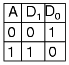
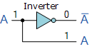
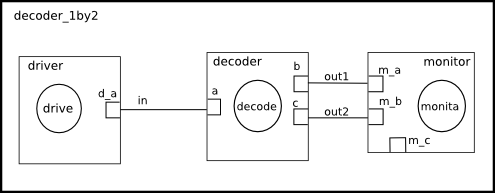

This is a 1-by-2 decoder example, it is a makefile project so no need for an IDE. 
Just cd into this folder and run 'make decoder'

A line decoder is a device that changes the input code into a set of signals. It takes an n-digit binary number and decodes it into 2n data lines It does the reverse of encoding. 
Its truth table: 

  

Circuit:

  

Model of computation:

  

